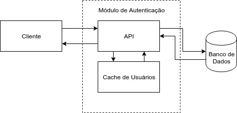

# Sistema de Autenticação

## Tarefa
Implementar uma solução de estrangulamento de um módulo de um monolito para microsserviço.
Onde a primeira etapa é ter o sistema de autenticação separado. Este microsserviço apenas valida login e password.

## Cache
Inicalmente a cache não seria implementada já que ela seria usada apenas para esconder a latência de acesso ao banco. E neste exemplo simplificado os usuarios estarão armazenados no próprio código. Já que
em uma aplicação real a gestão das senhas implica em uma série de outras questões como o uso de salt em uma função de hash adequada, comunicação com banco de dados e cadastro dos usuários no sistema.

Porém, durante o desenvolvimento da tarefa percebeu-se que quetões como a escalabilidade da aplicação e o teste de carga não fariam sentido com dados armazenados no próprio executável. Portanto, optou-se pelo armazenamento dos dados no banco mas, por simplicidade,  ignorando algumas questões fundamentais de segurança. Estas questões são mais relacionadas ao banco de dados em sí, do que ao sistema responsável pela autenticação.

Com isso, foi desenvolvida uma cache na linguagem go. Com o objetivo de evitar que diversas requisições sejam feitas para o banco buscando o mesmo usuario. Ela utiliza o algoritmo Least Frequently Used (LFU), ou seja, a partir do momento que a cache está cheia(alcançou a quantidade máxima permitida de registros) os valores que estão a mais tempo sem ser consultados são substituidos. A cache é ilustrada na figura abaixo:

Vale ressaltar porém que a implementação realizada não garante que duas requisições concorrentes para o mesmo usuario não resultam em duas consultas ao banco. Mas a partir do momento que a senha correspondente ao nome é escrita na cache a implementação garante que não serão realizadas mais consultas. Enquanto este dado estiver armazenado na cache. Este comportamento é devido à decisão de não bloquear a cache enquanto o dado é buscado no banco. Pois esse tipo de bloqueio impactaria no desempenho de outras consultas e o custo de realizar buscas pelo mesmo nome até que ele esteja na cache não é tão alto.

Uma cache como a descrita nesse exemplo só faz sentido com dados fixos de usuarios. E uma mudança na tabela que armazena os usuarios poderia invalidar dados armazenados na cache. Isso poderia ser resolvido com troca de menssagens entre os módulos de autenticação e de gestão dos dados dos usuarios. Mas como neste exemplo só existe uma versão simplificada do modulo de autenticação esse problema não foi abordado.   

## Mensageria
Para o exemplo abordado o uso e um servidor intermediário para rotear mensagens não parece fazer sentido. Já que o uso de tal servidor adicionaria latencia e a api conta atualmente com um único endpoint.
## GraphQL
GraphQL é uma linguagem de consulta para APIs que oferece flexibilidade e 
miminiza a quantidade de dados que transmitida entre cliente e servidor. 
No entanto, como a presente tarefa consiste de uma validação de login e senha,
    essas capacidades não são necessárias neste contexto.
    
## Documentação da API
A documentação da API foi feita utilizando o framework swagger. Já que ele possui um ecossistema de ferramentas bastante desenvolvido e por permitir que a implementação e a documentação avancem juntas. 

## Banco de Dados
O Sistema de Gerenciamento de Banco de Dados (SGBD) utilizado para este exemplo foi o MySQL. Não existe nenhuma razão especial para esta escolha é simplemente uma questão de comodidade(o MySQL já estava instalado no sistema utilizado).

O esquema utilizado possui uma única tabela contendo todas as credencias de todos os usuarios do sistema. Todas as informações estão em testo puro, isso é inaceitável em um sistema produtivo. Porém como o foco deste exemplo é a verificação de credenciais a segurança do banco foi negligenciada.

Para o acesso ao banco foi utilizada uma pool de conexões. Elas são alocadas no inicio da execução do servidor para não aumentar o tempo de acesso no momento do envio das requisições. A quantidade de conexões é definida pela constante `maxConexoesBanco` no arquivo `gerentedados/constantes.go`. 

Dois cuidados com a pool de conexões deveriam ser tomados mas ficaram de fora nesse exemplo. O primeiro é evitar que a mesma conexão seja dada a duas threads. Isso poderia ser alcançado com um array que diz se a conexão está em uso ou usando um valor limite para a próxima conexão que avançaria conforme as conexões foram liberadas. O segundo, é garantir que a conexão continua ativa.
Esses cuidados não foram tomas dor limitações de tempo e imprevistos (alarme da vizinha tocando por quase duas horas). 
## Teste de carga 
Para facilitar a realização de testes de carga foi criado o arquivo `teste/testedeCarga.go`. Ele permite a execução de um teste com x requisições por segundo e y threads de forma simples. Basta executar o seguinte comando `go run teste/testedeCarga.go -numeroThreads=200 -postsPorSegundo=30`, o resultado dele pode ser visto em `teste/usuarioFixo.log`.O resultado mencionado anteriormente é para a mesma requisição executada diversas vezes. No entanto, isso faz com que muitas requisições busquem dados da cache.
Para consultar dados com usuarios aleatórios basta executar o comando `go run teste/testedeCarga.go-numeroThreads=200 -postsPorSegundo=30 -usuarioVariavel`. O resultado deste teste pode ser encontrado no arquivo `teste/usuarioVariavel.log`.

Os dois casos de teste mencionados acima são pouco realistas mas dão uma ideia de como a API se comportaria em casos extremos. No primeiro muitas requisições trazem dados da cache e na segunda o banco é acessado diversas vezes. 

